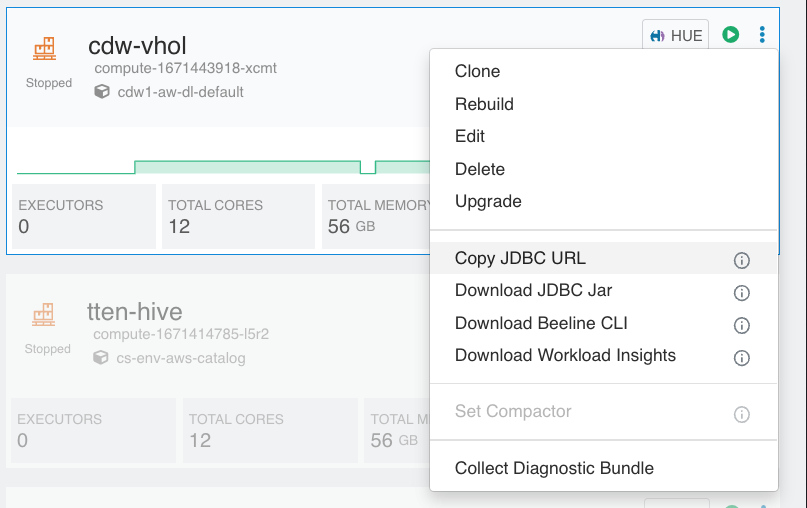
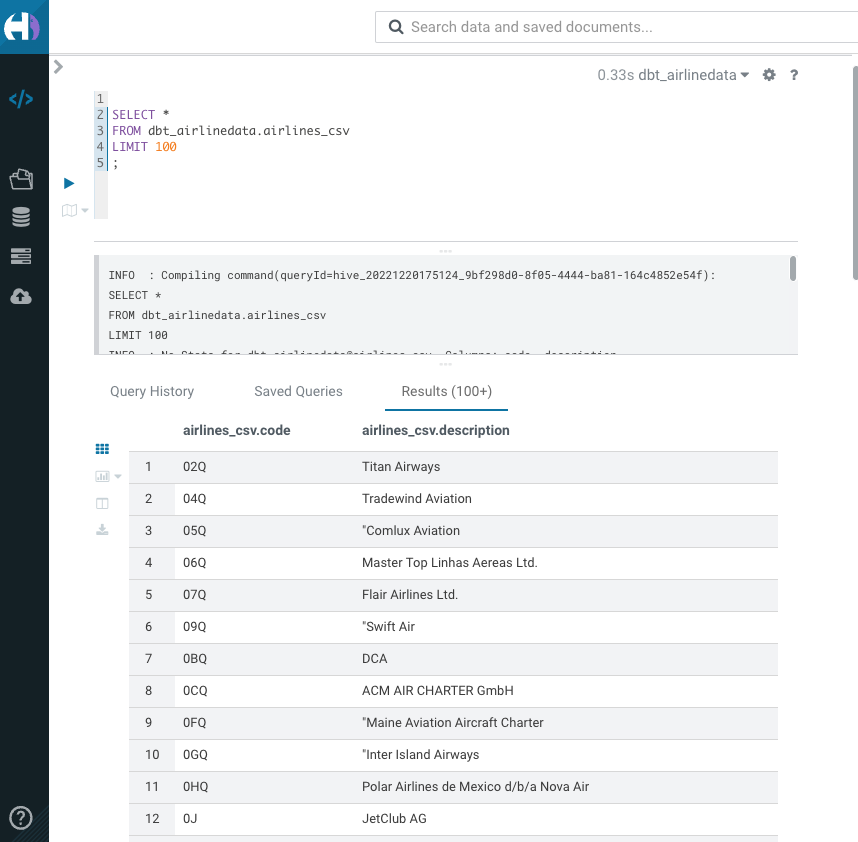

# dbt_airlinedata

## Prerequisits

### on your workstation
Python >= 3.8
dbt-core >= 1.3.0
git
Atom editor

### in CDP

Provisioned a Hive CDW virtual warehouse
Loaded airlinedata set into S3 buckets of your CDP environment

## Install

Start by cloning this repo
```
git clone https://github.com/frothkoetter/dbt_airlinedata
```

Next install the requirements

```
pip install dbt-core==1.3.0
pip install dbt-hive==1.3.1
```

### Configure connection to cdw

create a file setenv.sh
```
% vi setenv.sh
```
Copy and past into file and adjust the environment variables

```
export DBT_HIVE_SCHEMA=dbt_airlinedata
export DBT_HIVE_USER=frothkoetter
export DBT_HIVE_PASSWORD='XXXXXXXXX'
export DBT_HIVE_HOST=hs2-cdw-vhol.dw-cdw1-aw-env.a465-9q4k.cloudera.site
export DBT_HIVE_PORT=443
export DBT_HIVE_HTTP_PATH=jdbc:hive2://hs2-cdw-vhol.dw-cdw1-aw-env.a465-9q4k.cloudera.site/default;transportMode=http;httpPath=cliservice;socketTimeout=60;ssl=true;auth=browser;
```
The DBT_HIVE_HOST and DBT_HIVE_HTTP_PATH copy from your CDW Hive virtual warehouse



Set the environment variables
```
chmod 700 setenv.sh
source setenv.sh
```

### Check installation

```
% dbt debug
```
Expected output

```
17:20:35  Running with dbt=1.3.0
dbt version: 1.3.0
python version: 3.9.12
python path: /opt/homebrew/opt/python@3.9/bin/python3.9
os info: macOS-12.4-arm64-arm-64bit
Using profiles.yml file at /Users/frothkoetter/se-tools/github/dbt-hive-example/dbt_airlinedata/profiles.yml
Using dbt_project.yml file at /Users/frothkoetter/se-tools/github/dbt-hive-example/dbt_airlinedata/dbt_project.yml

Configuration:
  profiles.yml file [OK found and valid]
  dbt_project.yml file [OK found and valid]

Required dependencies:
 - git [OK found]

Connection:
  host: hs2-cdw-vhol.dw-cdw1-aw-env.a465-9q4k.cloudera.site
  schema: dbt_airlinedata
  user: frothkoetter
  Connection test: [OK connection ok]

All checks passed!
```

# Prepare CDW Virtual warehouse

Go to HUE and create a datebase

```SQL
create database dbt_airlinedata;
```

Create external tables of the airlinedata set in S3

```SQL
use dbt_airlinedata;

drop table if exists flights_csv;
CREATE EXTERNAL TABLE flights_csv(month int, dayofmonth int,
 dayofweek int, deptime int, crsdeptime int, arrtime int,
 crsarrtime int, uniquecarrier string, flightnum int, tailnum string,
 actualelapsedtime int, crselapsedtime int, airtime int, arrdelay int,
 depdelay int, origin string, dest string, distance int, taxiin int,
 taxiout int, cancelled int, cancellationcode string, diverted string,
 carrierdelay int, weatherdelay int, nasdelay int, securitydelay int,
lateaircraftdelay int, year int)
ROW FORMAT DELIMITED FIELDS TERMINATED BY ',' LINES TERMINATED BY '\n'
STORED AS TEXTFILE LOCATION '/airlinedata-csv/flights' tblproperties("skip.header.line.count"="1");

drop table if exists planes_csv;
CREATE EXTERNAL TABLE planes_csv(tailnum string, owner_type string, manufacturer string, issue_date string, model string, status string, aircraft_type string, engine_type string, year int)
ROW FORMAT DELIMITED FIELDS TERMINATED BY ',' LINES TERMINATED BY '\n'
STORED AS TEXTFILE LOCATION '/airlinedata-csv/planes' tblproperties("skip.header.line.count"="1");

drop table if exists airlines_csv;
CREATE EXTERNAL TABLE airlines_csv(code string, description string) ROW FORMAT DELIMITED FIELDS TERMINATED BY ',' LINES TERMINATED BY '\n'
STORED AS TEXTFILE LOCATION '/airlinedata-csv/airlines' tblproperties("skip.header.line.count"="1");

drop table if exists airports_csv;
CREATE EXTERNAL TABLE airports_csv(iata string, airport string, city string, state DOUBLE, country string, lat DOUBLE, lon DOUBLE)
ROW FORMAT DELIMITED FIELDS TERMINATED BY ',' LINES TERMINATED BY '\n'
STORED AS TEXTFILE LOCATION '/airlinedata-csv/airports' tblproperties("skip.header.line.count"="1");

drop table if exists unique_tickets_csv;
CREATE external TABLE unique_tickets_csv (ticketnumber BIGINT, leg1flightnum BIGINT, leg1uniquecarrier STRING, leg1origin STRING,   leg1dest STRING, leg1month BIGINT, leg1dayofmonth BIGINT,   
 leg1dayofweek BIGINT, leg1deptime BIGINT, leg1arrtime BIGINT,   
 leg2flightnum BIGINT, leg2uniquecarrier STRING, leg2origin STRING,   
 leg2dest STRING, leg2month BIGINT, leg2dayofmonth BIGINT,   leg2dayofweek BIGINT, leg2deptime BIGINT, leg2arrtime BIGINT )
ROW FORMAT DELIMITED FIELDS TERMINATED BY ',' LINES TERMINATED BY '\n'
STORED AS TEXTFILE LOCATION '/airlinedata-csv/unique_tickets'
tblproperties("skip.header.line.count"="1");
```

Check that tables created and accessing the files in S3

```SQL
select * from airlines_csv;
```

Expected Output




### Run a single model

% dbt run -s airport_departing_airlines_pivot
